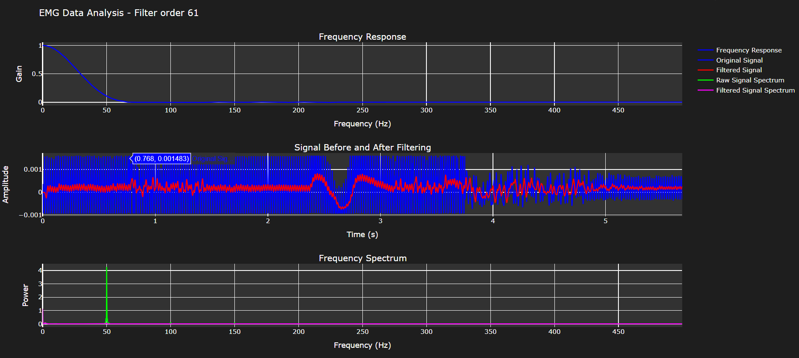
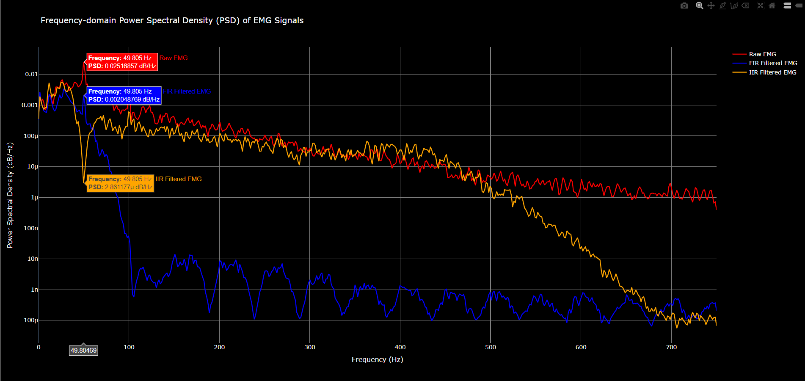

# STM32 EMG Acquisition and Filtering with FIR/IIR

This project implements an EMG (Electromyography) signal acquisition and filtering system using an STM32F407G microcontroller. The system applies FIR (Finite Impulse Response) and IIR (Infinite Impulse Response) filters to process the acquired EMG signals, eliminating power grid noise (50Hz) and filtering out frequencies above 500Hz.

## Table of Contents

- [Introduction](#introduction)
- [Hardware Requirements](#hardware-requirements)
- [Software Requirements](#software-requirements)
- [Filter Design](#filter-design)
- [Power Spectral Density (PSD) Analysis](#power-spectral-density-psd-analysis)
- TODO: [Implementation Details](#implementation-details)
  - [Circular Buffer](#circular-buffer)
  - [FIR Filter Implementation](#fir-filter-implementation)
- TODO: [How to Build and Run](#how-to-build-and-run)
- TODO: [Usage](#usage)
- TODO: [License](#license)

## Introduction

This project focuses on the acquisition and processing of EMG signals using the STM32F407G-DISC1 development borad. The primary goal is to acquire clean EMG signals by filtering out unwanted frequencies, specifically the 50Hz power grid noise and frequencies above 500Hz. The system uses FIR and IIR filters, with coefficients designed using Python's `scipy` library.

## Hardware Requirements

- **STM32F407G-DISC1** development board
- **MikroE EMG Click Module**
- **EMG electrodes**
- **3.5mm cable** with three electrode configuration
- **PC** for programming and debugging
- **USB Cable** for power and data transfer

## Software Requirements

- **IDE**: STM32CubeIDE (version X.X.X)
- **Toolchain**: GCC ARM Embedded
- **Library**: STM32 HAL (Hardware Abstraction Layer)
- **Python**: for filter design (`scipy` library)

## Filter Design

The FIR and IIR filters are designed using Python's `scipy` library. The design parameters are:

- **Sampling Frequency**: 1500 Hz
- **Band-Stop Filter**: Attenuates 50Hz (power grid noise)
- **Low-Pass Filter**: Attenuates frequencies above 500Hz

## Power Spectral Density (PSD) Analysis
The following image shows the Power Spectral Density (PSD) of the acquired EMG signal, highlighting the 50Hz power grid noise. The PSD plot demonstrates the effectiveness of the filter in attenuating the 50Hz noise component, which is critical for obtaining clean EMG signals.

As seen in the plot, the 50Hz noise is significantly reduced after applying the FIR/IIR filters, ensuring that the EMG signal retains its relevant frequency components while eliminating interference from the power grid.

